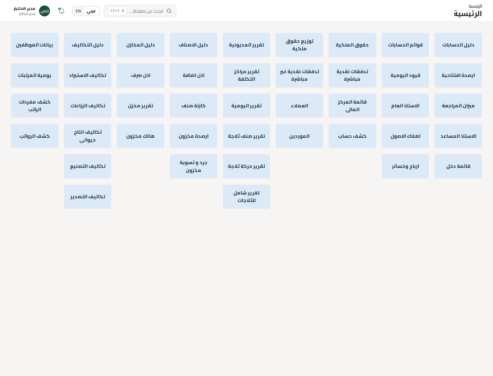

# نتيجة مراجعة الملف النهائي (2)

المرجع: حسابات عامة (2).xlsx والصورة المرسلة بتاريخ 2026-10-08. هذا التقرير يخص الفرع `feat/final-workbook-parity` المبني على `8bb4638`، ويحل محل أرقام الداشبورد السابقة في تقرير QA التاريخي.

## ما تغير

- Home والقائمة الجانبية والبحث تعرض 43 وجهة فقط، بنفس نصوص Home. ترتيب سطح المكتب 9 أعمدة و6 صفوف، مع فراغات الملف؛ الهاتف يعرض نفس الأزرار مع التفافها.
- أضيفت صفحات الموظفين ويومية المرتبات ومفردات الراتب وكشف الرواتب وربطها بقيود السلف والاستحقاق. إلغاء حركة غير مقفلة يعكس سلفتها ويحفظ أثر المراجعة.
- قوائم الحسابات أصبحت مستقلة عن دليل الحسابات. أدوات المستندات ومراكز التكلفة والمزارع داخل الصفحات المرتبطة بها. تقارير الثلاجات تقصر نتائجها على الثلاجات.
- استُبدلت قوالب التكلفة بالصيغة النهائية: 254 صيغة رقمية، وتسميات البنود الزراعية المرتبطة بالدليل. أُضيفت 79 صيغة توزيع حقوق الملكية الجديدة، منفصلة عن توزيع الأرباح الدفتري.

## نتائج الاختبارات المحلية

| الفحص | النتيجة | ما يثبته |
| --- | --- | --- |
| مقارنة XLSX الفعلي بخريطة Home | PASS، 43/43 | الاسم الحرفي والورقة المستهدفة لكل زر |
| مقارنة صيغ التكلفة مع المصدر | PASS، 254/254 | الصيغ بعد توسيع المراجع، مع إصلاحي إجمالي التصدير الموثقين |
| مقارنة صيغ توزيع حقوق الملكية | PASS، 79/79 | الصيغ النهائية بما فيها التسويات والنصوص |
| npm run typecheck | PASS | صحة أنواع المشروع |
| npm test | PASS، 12/12 | الحسابات والصيغ والتوازن وحصر الوجهات والمرتبات والتوزيع |
| npm run test:integration | PASS | الترحيل والعكس والتكرار وعزل الشركات والمخزون والإقفال والرجوع عند الفشل، على PGlite مؤقت |
| npm run build | PASS | بناء الإنتاج، بما فيه API المرتبات والتوزيع الجديد |
| npm run test:http | PASS | جلسات وصلاحيات وCSRF، مستند شراء ومخزون وقيد وتكلفة وتقارير؛ مرتبات وإلغاء سلفة وتوزيع محفوظ |
| Chromium / Playwright | PASS، 43/43 صفحة | أسماء Home وروابطها ومواضعها، حفظ وترحيل قيد من الواجهة، عرض الرواتب، العربية والإنجليزية، الجوال دون تجاوز عرض الشاشة |
| npm run lint | PASS مع تحذيرات | لا توجد أخطاء؛ تحذيرات React الحالية موضحة في خرج الأمر |

اختبار المصدر قابل لإعادة التشغيل محليًا بواسطة `python scripts/verify-final-workbook.py /private/path/workbook.xlsx` مع openpyxl. لا يطبع بيانات العميل ولا يستوردها. مصدر الاختبار غير منشور في المستودع.

## مثال المرتبات المستخدم في الاختبار

الأساسي 6000؛ يوم 200 وساعة 25؛ غياب يوم، خصم نصف يوم، تأمينات 120، بدلات 300، مكافأة يومين، إضافي يوم و4 ساعات، وسلفة 1000.

الاستحقاقات 7000؛ الاستقطاعات 1420؛ الصافي 5580. قيد الاستحقاق: مدين مصروف المرتبات 6700، ودائن صافي مستحق 5580 وسلف 1000 وتأمينات 120. إعادة الطلب لا تنشئ سلفة أو استحقاقًا ثانيًا. الأساسي الجديد 6500 لا يغير يناير المرحل، ويناير في سنة تالية مستقل. صافي سالب يرفض الترحيل، وإلغاء الحركة قبل إقفالها يعيد الحساب ويعكس السلفة إن وجدت.

## معاينة الواجهة

## حدود هذه النتائج

هذه اختبارات محلية ببيانات صناعية؛ لم تُستورد معاملات العميل أو أرصدته أو بيانات موظفيه. مقارنة الصيغ البنيوية ليست إثباتًا لمطابقة كل نتيجة تاريخية في Excel. اختلافات الحساب المتعمدة وأثرها موثقة في [خريطة الملف](WORKBOOK-MAPPING.md)، وتشمل المتوسط الدوري وبعض صيغ المرتبات والتصدير وسياسة توزيع الأرباح.

اختبار PGlite لا يثبت التزامن على PostgreSQL الحقيقي؛ Workflow GitHub المرفق يشغّل اختبار PostgreSQL 16. نشر هذا الفرع على السيرفر خطوة منفصلة. التحديث لا يضيف migrations ولا يحتاج إعادة seed أو إنشاء المدير؛ راجع [دليل التحديث](DEPLOYMENT.md).
